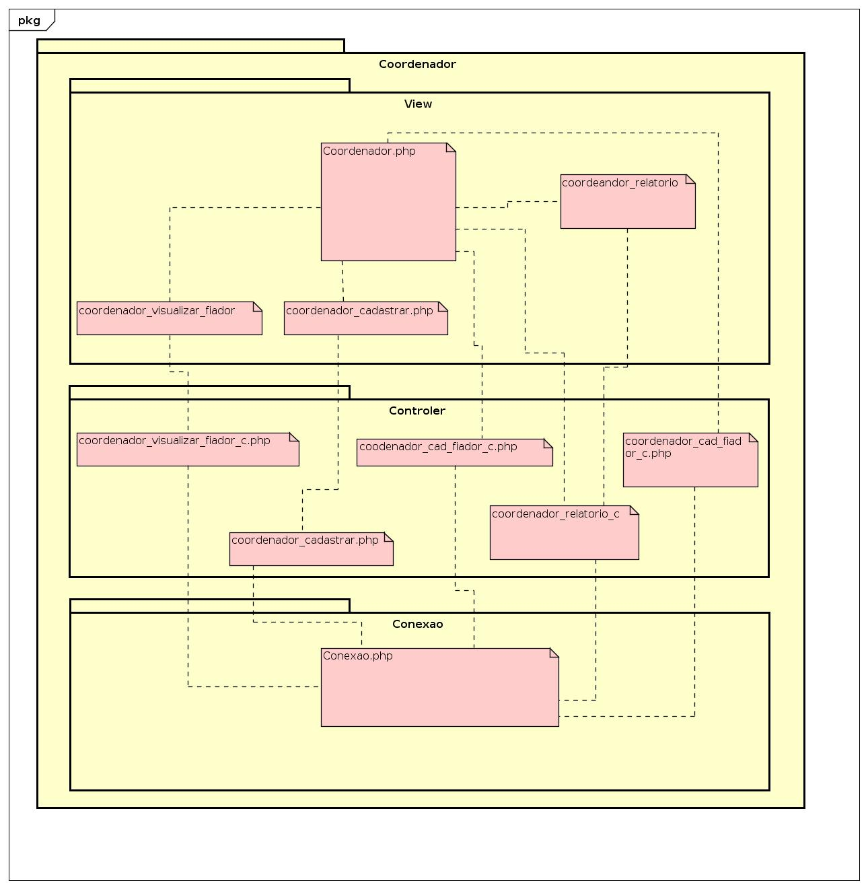

# banco de horas

## mini mundo
Em entrevista com um representante do pólo Embrapii de inovação no campus vitória, foi relatado a necessidade criação de uma solução para o problema de registro de horas e atividades feitas pelos bolsistas e pesquisadores.
Atualmente existe um problema citado por ele, o relatório possui muitos dados irrelevantes ao sistema ele gostaria de ao final de uma iniciação gerar um relatório com os seguintes dados.   

|Nome bolsista| descrição da atividade| data | hora inicio | hora fim | total de horas|
|----|----|----|----|----|----|
| Marcelo Passamai Mendes | Elaboração de um sistema web para o polo embrapii | 13/12/2018 | 12:30 | 17:00 | 4h 30m |


Os projetos podem ser financiados pela Embrapii ou pelo Pólo de inovação.
Em casos de projetos financiados pela **Embrapii.** 
```
Mínimo de 2 Bolsistas vinculados a quaisquer universidade ou escola técnina do Brasil.
1 Coordenador Responsável credenciado pelo pólo vitória, com horas alocadas dentro do campus vitória.
Pesquisador Somente se for do IFES e com horas alocadas no campus vitória. 
```
Em casos de projetos financiados 100% pelo **Polo de inovação.**
```
Mínimo de 2 Bolsistas vinculados a quaisquer universidade ou escola técnina do Brasil
ou qualquer estudando sem vinculado  empregatício.
O coordenador Deve ser do IFES mas pode ser de qualquer campus.
Pesquisadores Servidores podem ser qualquer um desde que possam se dedicar ao projeto.
```
cada projeto deve ter :
1 coordenador, no mínimo 2 bolsistas e pesquisador é opcional. 
cada coordenador, bolsista e pesquisador podem fazer infinitos projetos desde que não passe de 20 horas.

## modelo conceitual


## modelo lógico


## Scripts
[create](BD/Script/create.sql)

[insert](BD/Script/insert.sql)

[create+insert](BD/Script/create_insert.sql)

## projeto da arquitetura do sistema

### usuario coordenador



### usuario bolsista


